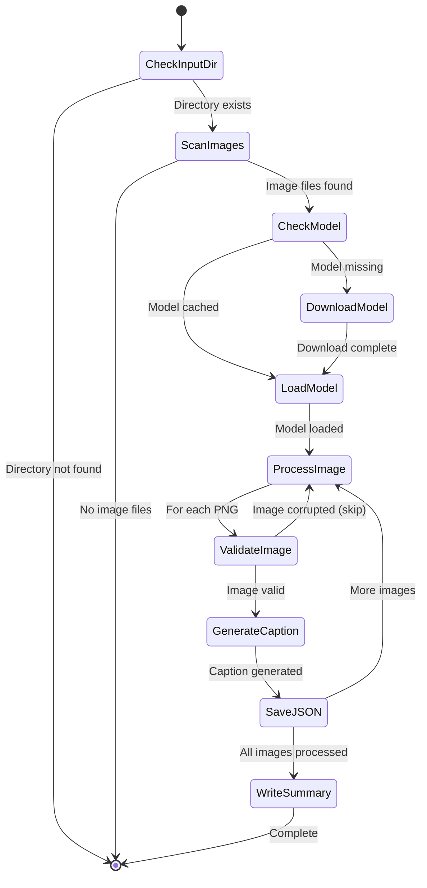

# MLX Image Captioning

This project captions every image (PNG, JPG, JPEG) inside the `input/` directory using a local MLX vision-language model. It ships with a CLI entry point in `src/main.py` that targets [lmstudio-community/Qwen3-VL-30B-A3B-Instruct-MLX-8bit](https://huggingface.co/lmstudio-community/Qwen3-VL-30B-A3B-Instruct-MLX-8bit); if the weights are missing locally, the script will download them automatically.

## Workflow



## Prerequisites

- macOS with Apple silicon (MLX requirement)
- Python 3.11+
- Local copy of the MLX model weights (downloaded automatically if absent and stored under `~/.cache/huggingface/hub/models--<repo-id>` by default).
- [`mlx-vlm`](https://github.com/Blaizzy/mlx-vlm) installed (`pip install mlx-vlm`). This project relies on the
  extra multimodal helpers exposed there because `mlx-lm` alone does not currently support injecting vision features.
- PyTorch + TorchVision (for the Qwen3 video processor dependency). Install via the
  [official instructions](https://pytorch.org/get-started/locally/) that match your platform, e.g.:
  `pip install torch torchvision --extra-index-url https://download.pytorch.org/whl/cpu`.

## Setup

```bash
python -m venv .venv
source .venv/bin/activate
pip install --upgrade pip
pip install -r requirements.txt
```

If `mlx` wheels are not available for your Python version, install a supported version from [mlx.dev](https://ml-explore.github.io/mlx/build/html/install.html) and then install `mlx-lm`.

## Usage

```bash
python src/main.py \
  --input-dir input \
  --output-dir output
```
## Example INPUT:
```bash
% python src/main.py \
  --repo-id mlx-community/Qwen3-VL-30B-A3B-Instruct-bf16 \
  --input-dir input \
  --output-dir output_bf16
21:55:26 - INFO - Output directory: output_bf16
21:55:26 - INFO - Found 31 image(s) in input
Model files not found at /Users/spider/.cache/huggingface/hub/models--mlx-community--Qwen3-VL-30B-A3B-Instruct-bf16. Initiating download for 'mlx-community/Qwen3-VL-30B-A3B-Instruct-bf16'.
chat_template.jinja: 5.29kB [00:00, 12.8MB/s]                                                                                                                      | 0/28 [00:00<?, ?it/s]
.gitattributes: 1.57kB [00:00, 23.0MB/s]
chat_template.json: 5.50kB [00:00, 22.5MB/s]                                                                                                               | 1/28 [00:00<00:15,  1.70it/s]
config.json: 7.18kB [00:00, 20.3MB/s]s]
added_tokens.json: 100%|█████████████████████████████████████████████████████████████████████████████████████████████████████████████████████████████████| 707/707 [00:00<00:00, 12.8MB/s]
generation_config.json: 100%|████████████████████████████████████████████████████████████████████████████████████████████████████████████████████████████| 269/269 [00:00<00:00, 5.85MB/s]
README.md: 100%|█████████████████████████████████████████████████████████████████████████████████████████████████████████████████████████████████████████| 592/592 [00:00<00:00, 13.5MB/s]
merges.txt: 1.67MB [00:00, 18.3MB/s]                                                                                                                            | 0.00/269 [00:00<?, ?B/s]
model-00008-of-00013.safetensors: 100%|██████████████████████████████████████████████████████████████████████████████████████████████████████████████| 4.98G/4.98G [07:26<00:00, 11.2MB/s]
model-00004-of-00013.safetensors: 100%|██████████████████████████████████████████████████████████████████████████████████████████████████████████████| 4.98G/4.98G [07:44<00:00, 10.7MB/s]
model-00007-of-00013.safetensors: 100%|██████████████████████████████████████████████████████████████████████████████████████████████████████████████| 4.98G/4.98G [08:32<00:00, 9.73MB/s]
model-00003-of-00013.safetensors: 100%|██████████████████████████████████████████████████████████████████████████████████████████████████████████████| 4.98G/4.98G [08:45<00:00, 9.49MB/s]
...
22:09:14 - INFO - [1/31] Processing diagram01.jpg...
22:09:35 - INFO - ✓ Saved caption to diagram01.json
22:09:35 - INFO - [2/31] Processing diagram02.jpg...
...
22:15:51 - INFO - [31/31] Processing diagram31.png...
22:16:03 - INFO - ✓ Saved caption to diagram31.json
Wrote 31 caption files to output_bf16
```

Key flags:

- `--system-prompt` – customise the system role for the assistant.
- `--user-prompt` – text shown alongside each image (`Describe the contents of this image.` by default).
- `--max-tokens` / `--temperature` – control decoding.
- `--model` – choose a custom directory for the MLX weights (defaults to `~/.cache/huggingface/hub/models--<repo-id>`).
- `--repo-id` – override the Hugging Face repository to pull if the model directory is missing.


## Example OUTPUT:

The script writes one JSON file per image to `output/` (e.g. `diagram10.json`) plus a combined `output/captions.json` containing a list of all results.

**Individual caption file (`output/diagram10.json`):**
```json
{
  "image": "diagram10.jpg",
  "prompt": "Describe the contents of this image.",
  "caption": "The image shows a flowchart diagram with multiple connected boxes..."
}
```

**Combined output file (`output/captions.json`):**
```json
[
  {
    "image": "diagram01.jpg",
    "prompt": "Describe the contents of this image.",
    "caption": "A technical architecture diagram showing..."
  },
  {
    "image": "diagram02.jpg",
    "prompt": "Describe the contents of this image.",
    "caption": "A sequence diagram illustrating..."
  }
]
```

If `mlx-vlm` is not installed the script exits early with a clear message, as the multimodal checkpoints require the vision helpers bundled with that package.

## Notes

- Supported image formats: PNG, JPG, and JPEG.
- The script validates each image with Pillow before inference to catch corrupted files early.
- Detailed logging shows processing progress and any errors encountered.
- Ensure the model folder contains the `params.json`, `tokenizer.model`, and MLX weight shards expected by `mlx_lm.load`.
